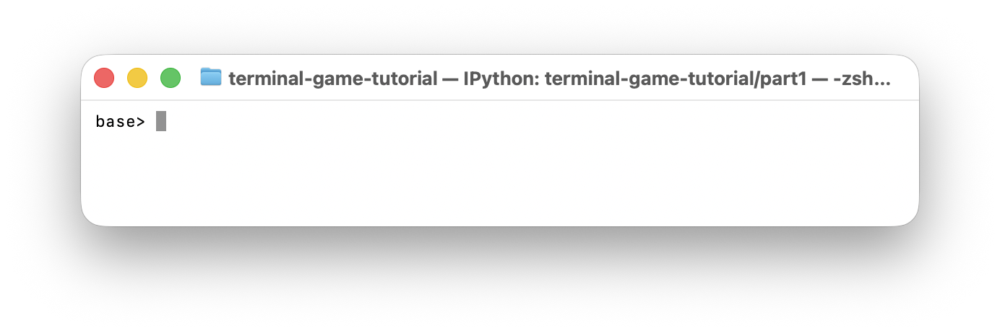
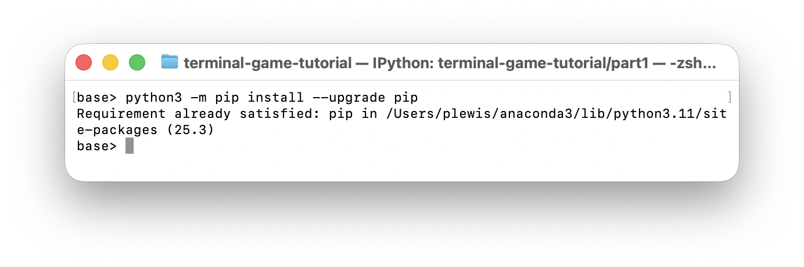
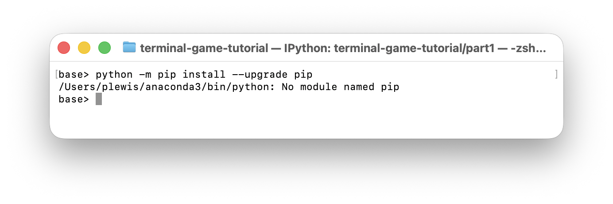
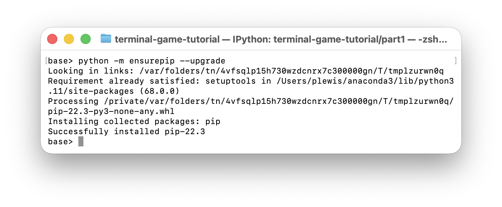
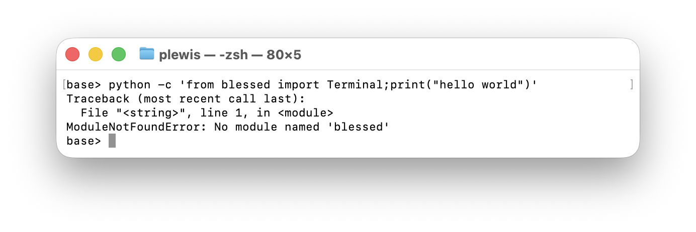

# PART 1: Getting started

### 1.1: A brief introduction of everything

This project is based on the terminal game tutorial of fundamelon
, fundamelon/terminal-game-tutorial in c++, translated to Python using the blessed library.

# PART 2: requirements

### 1.1: Update `pip`

You probably have `pip` on your system already, if you have Python, but you should probably make sure it is up to date.

Open a terminal (look this up if you don't know how):



and at the prompt (i.e. after it says `base> ` here (it will be different on your computer, probably), type:

```
python -m pip install --upgrade pip
```



If this responds with `No module named pip`, then you don't have `pip` installed (or not for the version of Python you are now using). 



So, install it for your computer. [There are multiple options for this](https://pip.pypa.io/en/stable/installation/), depending on your system, so read about it and install `pip`.

e.g. (but [check for your system](https://pip.pypa.io/en/stable/installation/)):

```
python -m ensurepip --upgrade
```



You should test again now, as above, to make sure.


```
python -m pip install --upgrade pip
```


### 1.2: Testing for `blessed`

These tutorials requires the Python library `blessed` for a simple interface to text-based screen coding, so let's check you have that:

Open a terminal:


and at the prompt type:

```
python -c 'from blessed import Terminal;print("hello world")'
```

If this is ok, it will print "hello world" in the terminal.


If this fails, it will report something like:

`ModuleNotFoundError: No module named 'blessed'`

and you should then install the library. 



### 1.3: Install `blessed`

If you need to, install the `blessed` library. You should not proceed if you have not got this working.

Most commonly, this involves you downloading and installing using `pip`, by typing at the prompt:

```
python -m pip install blessed
```

If this responds with `Requirement already satisfied: blessed`, then you already have it installed, but no harm done. Otherwise, it should look something like this:


In any case, make sure you confirm, running the test you did before:

```
python -c 'from blessed import Terminal;print("hello world")'
```

If thats all good, then you can start learning how to write simple games in Python with `blessed`.
